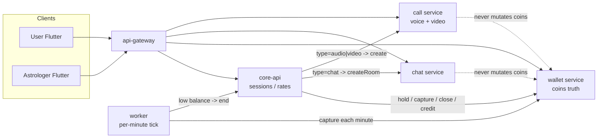
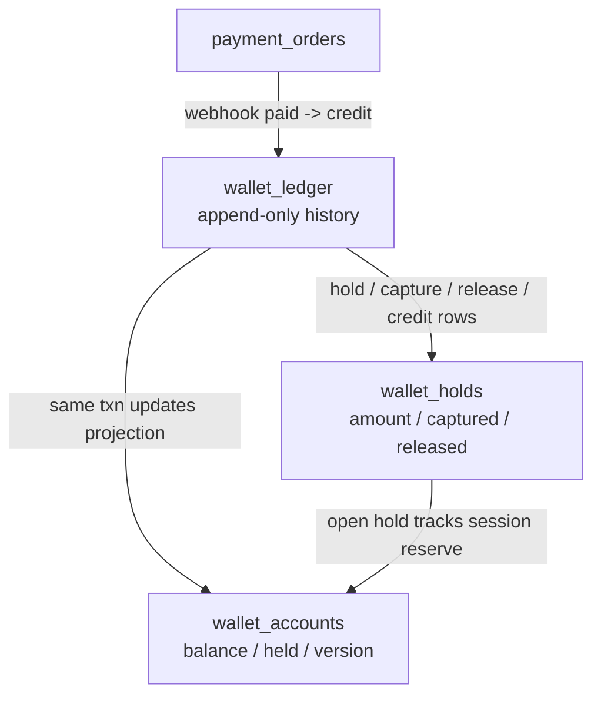
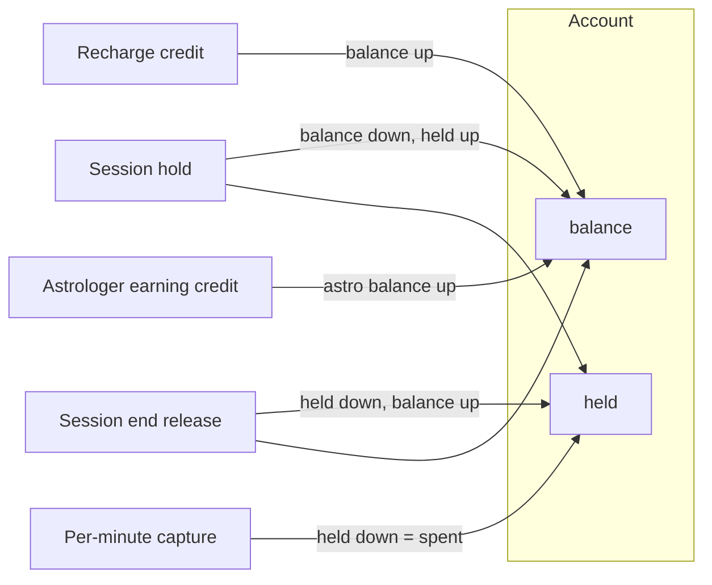
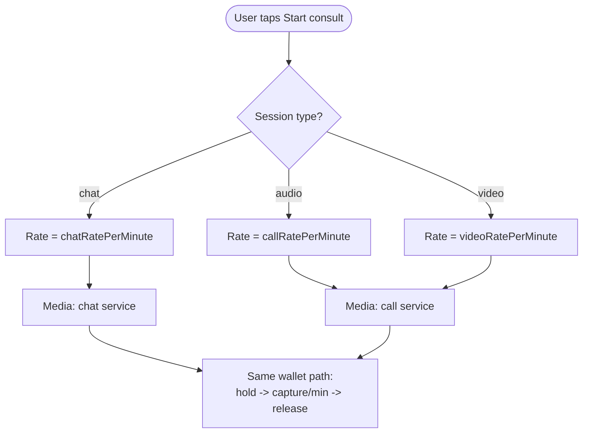
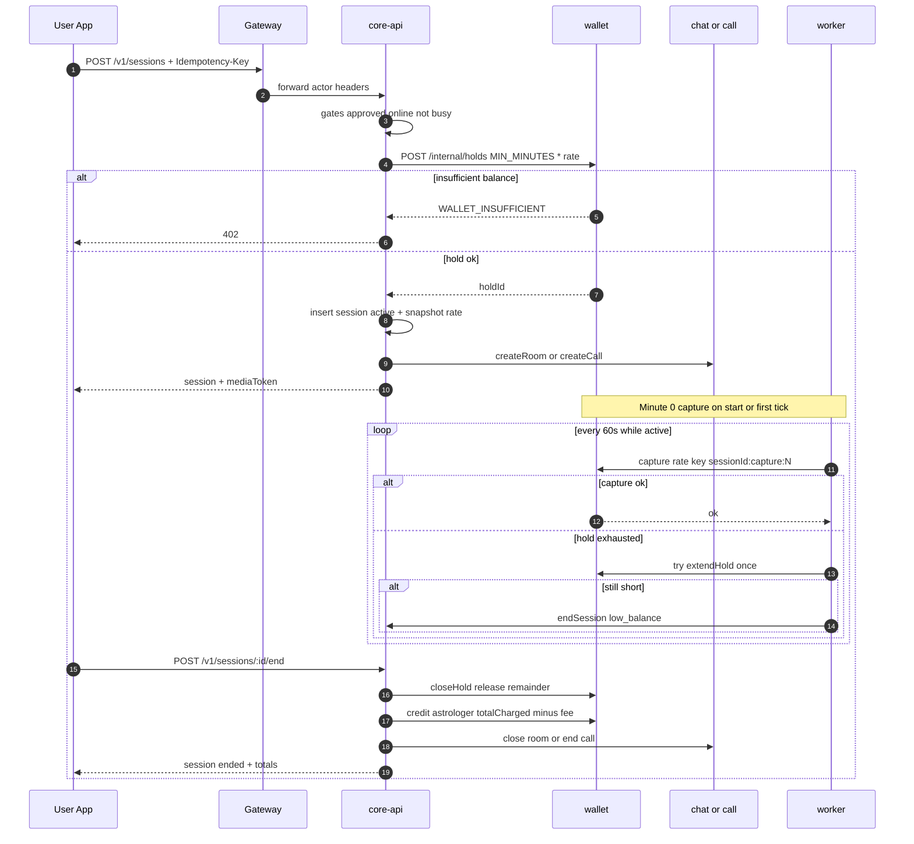
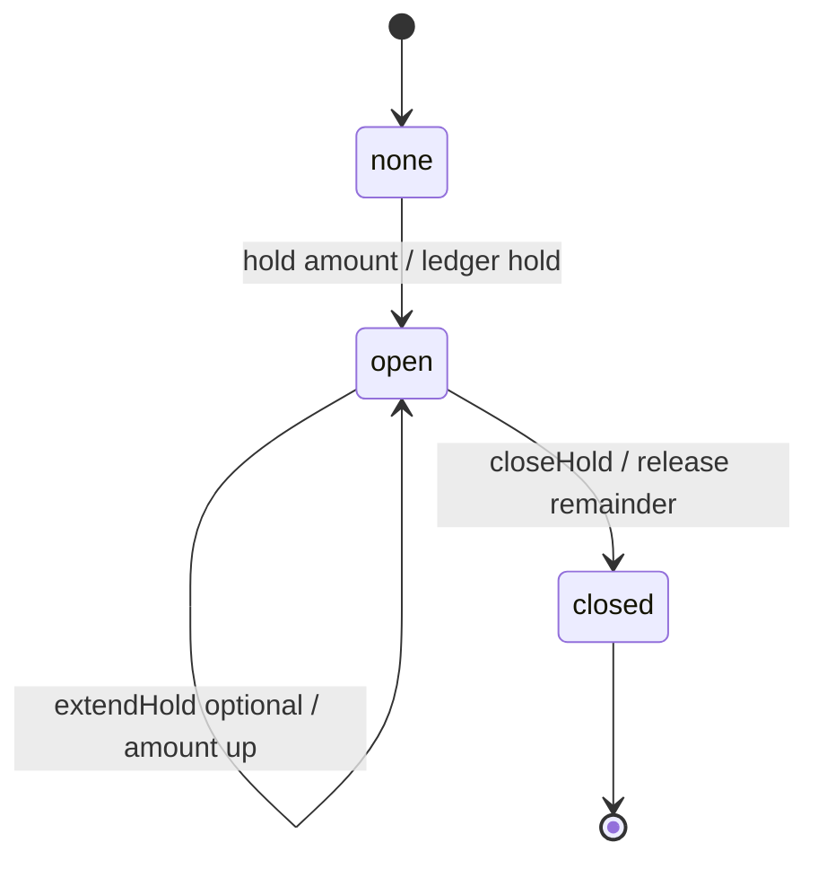
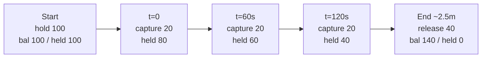
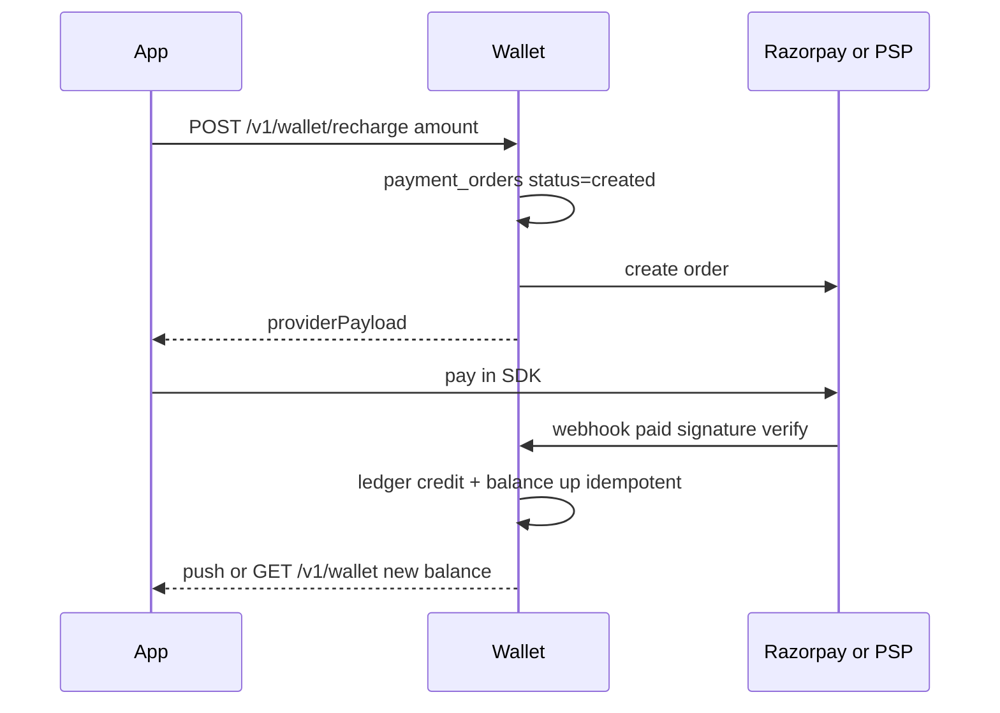
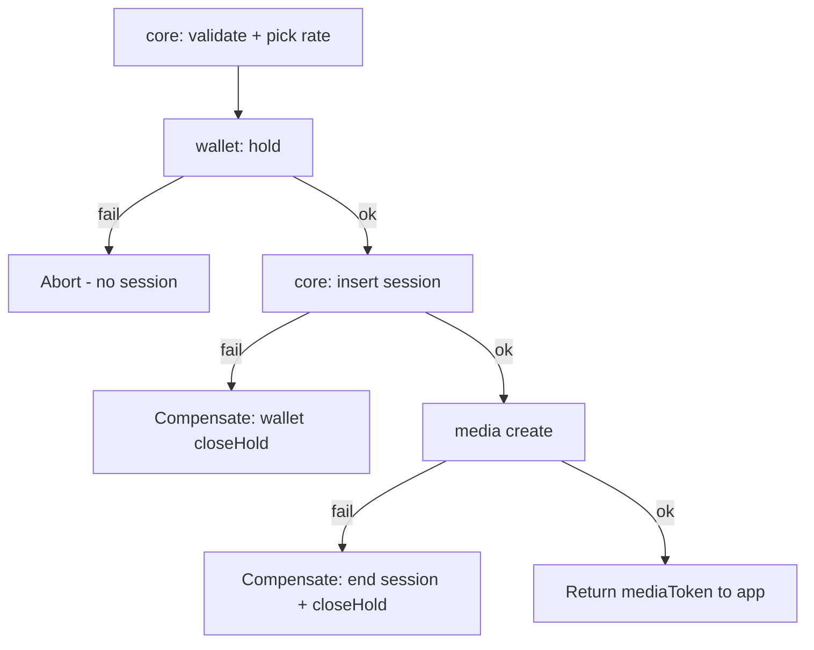

# Wallet state machine & Mongo transaction patterns

Money is the highest-risk domain. This doc is the implementation contract for `wallet` + `core-api` session billing.

**Audience:** backend developers implementing or reviewing the wallet / session billing module.

---

## 0. Visual guide (start here)

### 0.1 Who owns money vs media

Chat and call are **transport only**. Coins move only inside wallet, triggered by core-api sessions + the billing worker.



### 0.2 `wallet_*` collections — what handles what

| Collection | One-line job | Mutated when |
|------------|--------------|--------------|
| `wallet_accounts` | Current `balance` + `held` for a user/astrologer | Every money op |
| `wallet_holds` | Frozen pot for **one** active session | Start / capture / extend / end |
| `wallet_ledger` | Append-only audit trail (source of truth) | Every money op (1+ rows) |
| `payment_orders` | PSP recharge order lifecycle | Top-up create + webhook |



**Field meanings on the account:**

```
balance  = coins free to spend / start new sessions
held     = coins locked in open consult(s)
spendable for a new hold = balance only
```

UI recommendation: show **Available (`balance`)** and **In session (`held`)** separately. Money screens should prefer `GET /v1/wallet`, not denormalized `users.walletBalance`.

### 0.3 Coin movement cheat sheet



| Ledger `type` | `balance` | `held` | Meaning |
|---------------|-----------|--------|---------|
| `credit` | ↑ | — | Recharge, refund, promo, astro earning |
| `debit` | ↓ | — | Payout / rare admin |
| `hold` | ↓ | ↑ | Freeze coins for consult |
| `capture` | — | ↓ | Bill one minute (coins leave the wallet) |
| `release` | ↑ | ↓ | Return unused freeze at end |

### 0.4 Modalities (interim product rule)

Marketing may later allow parallel chat+call. **For now: individual services, one session = one type = one rate clock.**



| `sessions.type` | Microservice | Rate field |
|-----------------|--------------|------------|
| `chat` | `apps/chat` | `chatRatePerMinute` |
| `audio` | `apps/call` (voice) | `callRatePerMinute` |
| `video` | `apps/call` (video) | `videoRatePerMinute` |

Realtime billing is **time-based** (per minute), not per chat message or per call packet.

### 0.5 End-to-end consult flow



### 0.6 Hold lifecycle state machine



Invariants while `open`:

- `remaining = amount - captured - released`
- Next minute needs `remaining >= rate` (or extend first)
- `closed` ⇒ no further capture

### 0.7 Realtime deduction timeline (deep)

“Realtime” means a **billing clock**, not deducting on every message.



Same example as a table (rate = 20, start balance = 200, hold = 100):

| Time | Event | balance | held | hold.captured | User equity left |
|------|--------|---------|------|---------------|------------------|
| Start | `hold` 100 | 100 | 100 | 0 | 200 |
| +0s | `capture` 20 (minute 0) | 100 | 80 | 20 | 180 |
| +60s | `capture` 20 | 100 | 60 | 40 | 160 |
| +120s | `capture` 20 | 100 | 40 | 60 | 140 |
| End ~2.5m | `release` 40 | 140 | 0 | 60 | 140 |

Spent = **60**. Leftover hold returned. Astrologer later gets `credit` of `60 − commission`.

**Idempotency keys (required):**

| Op | Key pattern |
|----|-------------|
| Hold at start | client `Idempotency-Key` or `sessionAttemptId` |
| Minute N | `{sessionId}:capture:{N}` |
| Close | `{sessionId}:close` |
| Astro earning | `{sessionId}:earning` |

Retries must replay the same result — never double-charge.

### 0.8 Recharge (buy coins) flow



Never trust the client “payment success” callback alone; **webhook (or server verify)** is authoritative.

### 0.9 Saga across core + wallet (no cross-DB txn)



Wallet DB transactions stay **inside wallet**. Core talks to wallet over HTTP.

---

## 1. Principles

1. **Ledger is source of truth.** `wallet_accounts.balance` / `held` are projections updated in the same transaction as the ledger insert.
2. **All amounts are integer paise** (or integer “coins” with a fixed mapping). Never use floats.
3. **Every mutation has an `idempotencyKey`.** Retries must not double-charge.
4. **Chat and call never touch money.** They are separate media services; billing is always session + wallet.
5. **Holds before talk.** No active session without an open hold covering at least `MIN_MINUTES`.
6. **Append-only ledger.** No updates/deletes to `wallet_ledger` rows.
7. **One session = one modality.** Interim: `chat` **or** `audio` **or** `video` — not parallel dual meters. Marketing may change this later; wallet primitives stay the same.

## 2. Account fields

```
available = balance
reserved  = held
spendable for new holds = balance
total equity ≈ balance + held
```

## 3. Hold lifecycle (detail)

No re-open after `closed`. To add more minutes mid-session:

- **A (MVP):** top-up hold — second `hold` ledger line + increase `WalletHold.amount`, or  
- **B:** extension hold rows linked to same `sessionId` (harder).

**MVP sizing:**  
`holdAmount = max(MIN_MINUTES, min(floor(balance/rate), MAX_HOLD_MINUTES)) * rate`  
On low remaining, try `extendHold` once; if fail → end session (`low_balance`).

## 4. Session × wallet sequence (detail)

### 4.1 Start

```
core-api Session.start (Idempotency-Key: client key)
  ├─ validate user / astrologer gates
  ├─ rate = price_tiers[astro.priceTier][type]   // paise/min
  ├─ holdAmount = rate * MIN_MINUTES             // e.g. 5
  ├─ POST wallet /internal/holds
  │    { ownerType:user, ownerId, amount:holdAmount,
  │      sessionId, idempotencyKey, reason:session_hold }
  ├─ insert session status=active, ratePerMinute, walletHoldId
  ├─ set presence busy
  ├─ if type=chat → chat.createRoom
  │  if type=audio|video → call.create({ mode: type })
  └─ mint media JWT (sessionId, type, both actor ids, exp short)
```

If wallet returns `WALLET_INSUFFICIENT` → do not create session.

### 4.2 Tick (worker every 60s)

```
for session in active:
  with redis lock session:{id}:
    minuteIndex = floor((now - startedAt) / 60)  // 0-based
    key = `${sessionId}:capture:${minuteIndex}`
    res = wallet.capture({ holdId, amount:rate, idempotencyKey:key, refId:sessionId })
    if res.code == WALLET_INSUFFICIENT || HOLD_EXHAUSTED:
       try extendHold once
       else endSession(low_balance)
    update session.billedMinutes, totalCharged
```

**Billing policy:** charge **at the beginning of each minute** (minute 0 on start success).

### 4.3 End

```
core-api Session.end
  ├─ wallet.closeHold({ holdId, idempotencyKey:`${sessionId}:close` })
  │    → release remainder
  ├─ fee = totalCharged * commissionPct / 100
  ├─ wallet.credit({ ownerType:astrologer, amount:totalCharged-fee,
  │                  idempotencyKey:`${sessionId}:earning` })
  ├─ session status=ended, totals, endReason
  ├─ busy=false; revoke media token; close room/call
  └─ emit session.ended
```

## 5. Payment (recharge) state machine

```
created → paid → (ledger credit)
       ↘ failed
       ↘ expired
```

```
POST /v1/wallet/recharge { amount, idempotencyKey }
  → insert payment_orders created
  → create PSP order
  → return PSP payload to app

PSP webhook paid
  → verify signature
  → txn: if already paid return; else status=paid; ledger credit; balance↑
  → emit wallet.credited
```

## 6. Mongo transaction patterns

Use a replica set (Atlas). Wrap multi-document updates in `client.startSession()` + `withTransaction`.

### 6.1 Hold

```ts
async function hold(input: {
  ownerType: "user";
  ownerId: ObjectId;
  amount: number; // > 0
  idempotencyKey: string;
  sessionId: ObjectId;
  refType: "session";
}) {
  // 1) Fast idempotent pre-check outside txn
  const existing = await ledger.findOne({ idempotencyKey: input.idempotencyKey });
  if (existing) {
    return { replay: true, entry: existing, hold: await holds.findOne({ idempotencyKey: input.idempotencyKey }) };
  }

  const session = client.startSession();
  try {
    return await session.withTransaction(async () => {
      const again = await ledger.findOne({ idempotencyKey: input.idempotencyKey }, { session });
      if (again) { /* return replay */ }

      const acct = await accounts.findOne(
        { ownerType: input.ownerType, ownerId: input.ownerId },
        { session },
      );
      if (!acct || acct.balance < input.amount) {
        throw Object.assign(new Error("WALLET_INSUFFICIENT"), { code: "WALLET_INSUFFICIENT" });
      }

      const res = await accounts.updateOne(
        { _id: acct._id, version: acct.version, balance: { $gte: input.amount } },
        {
          $inc: { balance: -input.amount, held: input.amount, version: 1 },
          $set: { updatedAt: new Date() },
        },
        { session },
      );
      if (res.modifiedCount !== 1) {
        throw Object.assign(new Error("CONFLICT"), { code: "WALLET_CONFLICT" });
      }

      const balanceAfter = acct.balance - input.amount;
      const heldAfter = acct.held + input.amount;

      const holdDoc = await holds.insertOne({
        accountId: acct._id,
        ownerId: input.ownerId,
        sessionId: input.sessionId,
        amount: input.amount,
        captured: 0,
        released: 0,
        status: "open",
        idempotencyKey: input.idempotencyKey,
        createdAt: new Date(),
        updatedAt: new Date(),
      }, { session });

      await ledger.insertOne({
        accountId: acct._id,
        ownerId: input.ownerId,
        ownerType: input.ownerType,
        type: "hold",
        amount: input.amount,
        balanceAfter,
        heldAfter,
        reason: "session_hold",
        refType: "session",
        refId: input.sessionId,
        idempotencyKey: input.idempotencyKey,
        createdAt: new Date(),
      }, { session });

      return { holdId: holdDoc.insertedId, balanceAfter, heldAfter };
    });
  } finally {
    await session.endSession();
  }
}
```

**Why version + `balance >= amount` in filter?** Optimistic concurrency under contention (two sessions starting at once).

### 6.2 Capture from hold

```ts
async function capture(input: {
  holdId: ObjectId;
  amount: number; // ratePerMinute
  idempotencyKey: string; // sessionId:capture:minuteIndex
  sessionId: ObjectId;
}) {
  // idempotent pre-check...
  await session.withTransaction(async () => {
    const hold = await holds.findOne({ _id: input.holdId }, { session });
    if (!hold || hold.status !== "open") throw /* HOLD_CLOSED */;
    const remaining = hold.amount - hold.captured - hold.released;
    if (remaining < input.amount) throw /* HOLD_EXHAUSTED */;

    const acct = await accounts.findOne({ _id: hold.accountId }, { session });
    const upd = await accounts.updateOne(
      { _id: acct._id, version: acct.version, held: { $gte: input.amount } },
      { $inc: { held: -input.amount, version: 1 }, $set: { updatedAt: new Date() } },
      { session },
    );
    if (upd.modifiedCount !== 1) throw /* CONFLICT */;

    await holds.updateOne(
      { _id: hold._id, status: "open" },
      { $inc: { captured: input.amount }, $set: { updatedAt: new Date() } },
      { session },
    );

    await ledger.insertOne({
      type: "capture",
      amount: input.amount,
      balanceAfter: acct.balance,          // unchanged
      heldAfter: acct.held - input.amount,
      reason: "session_capture",
      refType: "session",
      refId: input.sessionId,
      idempotencyKey: input.idempotencyKey,
      // ...
    }, { session });
  });
}
```

### 6.3 Close hold (release remainder)

```ts
remaining = hold.amount - hold.captured - hold.released
if remaining > 0:
  balance += remaining
  held    -= remaining
  ledger type=release
hold.status = closed
hold.released += remaining
```

Idempotency key: `${sessionId}:close`.

### 6.4 Credit (recharge / astrologer earning)

Same pattern: versioned `$inc balance`, ledger `credit`, unique `idempotencyKey`.

### 6.5 Unique index as safety net

Unique index on `wallet_ledger.idempotencyKey` makes double-apply impossible. On duplicate key (11000), load existing row and return replay success.

## 7. Redis locks

| Lock key | Purpose | TTL |
|----------|---------|-----|
| `lock:session:{sessionId}` | Serialize tick + end | 15s |
| `lock:wallet:{ownerType}:{ownerId}` | Optional extra serialize | 10s |
| `presence:astro:{id}` | online/busy/lastSeen | 60s refresh |

Worker must extend lock while working; end session must acquire same lock.

## 8. Error codes (stable API)

| Code | HTTP | Meaning |
|------|------|---------|
| `WALLET_INSUFFICIENT` | 402 | Not enough available balance |
| `WALLET_CONFLICT` | 409 | Version race; client may retry |
| `HOLD_EXHAUSTED` | 402 | Open hold cannot cover next minute |
| `HOLD_CLOSED` | 409 | Capture/release on closed hold |
| `IDEMPOTENCY_REPLAY` | 200 | Same key returns original result |
| `PAYMENT_INVALID` | 400 | Bad PSP payload |
| `PAYMENT_NOT_CONFIRMED` | 409 | Webhook before order exists |

## 9. Denormalized balance sync

On `wallet.credited` / `wallet.hold` / `wallet.capture` / `wallet.release` events:

- optional FCM / WS balance tick for live UI
- core may mirror `users.walletBalance = balance` for display  
- **money screens:** `GET /v1/wallet` is authoritative

Do not compute charges from denormalized fields.

## 10. Commission & earnings

At session end:

```
totalCharged   = sum(captures)
platformFee    = floor(totalCharged * commissionPct / 100)
astroEarning   = totalCharged - platformFee
```

Credit astrologer wallet with idempotency `${sessionId}:earning`. Platform fee can be a system ledger account later; MVP may only store fee on the session doc.

## 11. Test matrix (must-have)

1. Double `hold` with same idempotency key → one hold  
2. Parallel session starts draining balance → one succeeds, one insufficient/conflict  
3. Capture same minute twice → one ledger row  
4. End twice → one release, one earning credit  
5. Webhook delivered twice → one credit  
6. Crash after ledger insert before ack → replay safe  
7. Tick after hold exhausted → session ends `low_balance`  
8. Astrologer busy cleared on end even if media close fails (compensate)  
9. `type=chat` never calls call-service; `audio|video` never creates chat room for billing  

## 12. What not to do

- Decrement `users.walletBalance` inside chat/call handlers  
- Store money as floating-point  
- Cross-DB Mongo transactions spanning `core` + `wallet` — use **HTTP saga** + compensation  
- Bill per message / per WebRTC packet  
- Assume parallel chat+call stacked rates until marketing locks that product rule  

<script>
(function () {
  if (window.__astroMermaidBooted) return;
  window.__astroMermaidBooted = true;

  function showError(msg) {
    console.error(msg);
    var note = document.createElement("p");
    note.style.color = "#cf222e";
    note.textContent = "Mermaid diagrams failed to render: " + msg;
    var first = document.querySelector("pre code.language-mermaid");
    if (first && first.parentNode && first.parentNode.parentNode) {
      first.parentNode.parentNode.insertBefore(note, first.parentNode);
    }
  }

  function renderMermaid() {
    if (typeof mermaid === "undefined") {
      showError("library not loaded (CDN blocked?)");
      return;
    }
    mermaid.initialize({
      startOnLoad: false,
      theme: "default",
      securityLevel: "loose",
      flowchart: { htmlLabels: true }
    });
    var blocks = document.querySelectorAll("pre code.language-mermaid");
    var graphs = [];
    for (var i = 0; i < blocks.length; i++) {
      var code = blocks[i];
      var pre = code.parentNode;
      if (!pre || !pre.parentNode) continue;
      var div = document.createElement("div");
      div.className = "mermaid";
      div.textContent = code.textContent;
      pre.parentNode.replaceChild(div, pre);
      graphs.push(div);
    }
    if (!graphs.length) return;
    try {
      if (typeof mermaid.run === "function") mermaid.run({ nodes: graphs });
      else mermaid.init(undefined, graphs);
    } catch (e) {
      showError(e && e.message ? e.message : String(e));
    }
  }

  var s = document.createElement("script");
  s.src = "https://cdn.jsdelivr.net/npm/mermaid@10.9.1/dist/mermaid.min.js";
  s.onload = renderMermaid;
  s.onerror = function () { showError("could not download mermaid.min.js from jsDelivr"); };
  document.head.appendChild(s);
})();
</script>
<style>
  .mermaid { margin: 1.25rem 0; overflow-x: auto; text-align: center; background: #f6f8fa; border: 1px solid #d0d7de; border-radius: 6px; padding: 1rem; }
  .mermaid svg { max-width: 100%; height: auto; }
</style>
